  

# 우냉부?

바쁜 현대 사회인들의 골치거리인 **냉장고 관리**를 도와주는 서비스로

직접적인 재료 및 음식의 **유통기한 관리 및 정리**

간접적으로는 (직접적인 서비스를 위한) **요리 레시피 추천 및 공유의 컨텐츠**를 제공하여,

궁극적으로 **냉장고의 효율적 관리**뿐만아니라 **자연 보호**를 목표로 하는 서비스입니다.

------


## 기획 배경

자취생 또는 주부들의 고민인 냉장고 관리를 목적으로 하였습니다.

- 유통기한 관리 : 유통기한을 효율적으로 관리하여 버려지는 음식물 쓰레기를 줄여 환경 파괴를 막고자 기획해보았습니다.

- 냉장고 내부 위치 저장 : 냉장고에 있는 재료들의 위치를 저장하여, 냉장고를 열고 찾는데 소요 되는 시간을 줄여, 에너지 낭비를 막고자 기획해보았습니다.

- 레시피 추천 및 공유 : 단순히 유통기한을 관리 해주는 것만으로는 부족하다고 생각하여, 레시피를 추천하고 사용자들간에 공유할 수 있도록하여 요리 초보들도 냉장고 관리를 잘할 수 있는 컨텐츠를 기획해보았습니다.

  

⇒ 위와 같은 서비스를 통해 효율적 냉장고 관리 및 레시피 추천 및 공유 서비스를 기획했습니다.

------


# Message Broker?

[Kafka (Zookeeper) 아키텍처](https://www.notion.so/Kafka-Zookeeper-746da634cc314fb7a0f4100518454b99)

- 참고자료

[Spring Boot | Kafka를 이용한 채팅 (2) Kafka 연동 설정](https://gaemi606.tistory.com/entry/Spring-Boot-Kafka를-이용한-채팅-2-Kafka-연동-설정?category=745027)

------


# ⚙️Tech Stacks

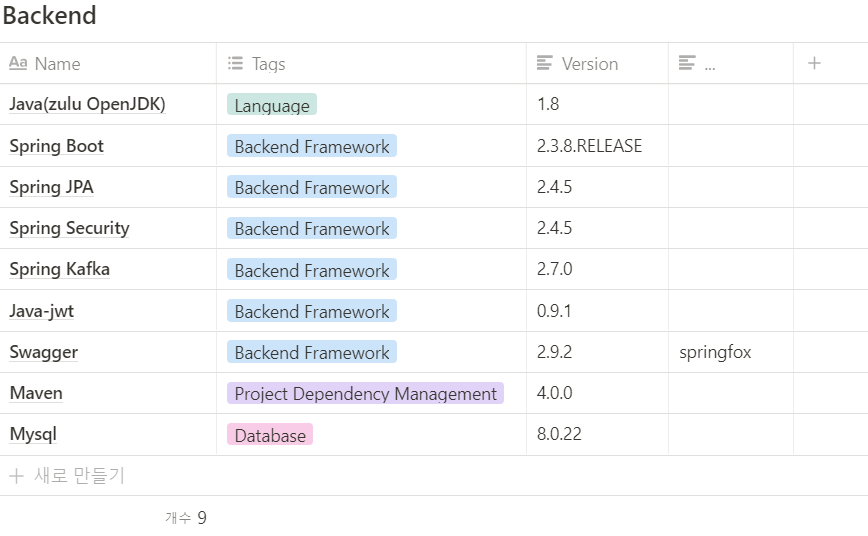

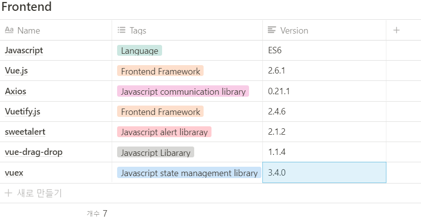

# DB_ERD

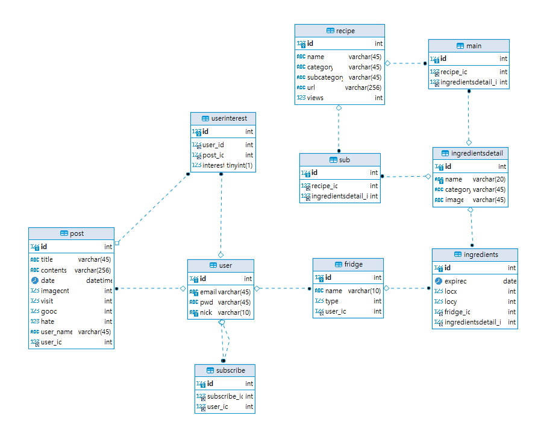


# Installation with Docker

### Kafka와 zookeeper 사용을 위하여 Docker에서 가동하는 방법만 제공

##### windows 10 Docker 설치

https://goddaehee.tistory.com/251

##### Linux(Ubuntu) Docker 및 docker-compose 설치

```shell
# 다음 패키지들을 설치
sudo apt install apt-transport-https ca-certificates
sudo apt install curl gnupg-agent software-properties-common

# Docker의 공식 GPG 키를 추가
curl -fsSL https://download.docker.com/linux/ubuntu/gpg | sudo apt-key add -

# stable respository 를 세팅하기 위한 명령어를 실행
sudo add-apt-repository \
	"deb [arch=amd64] https://download.docker.com/linux/ubuntu bionic stable"

# 가장 최신 버전의 Docker 엔진을 설치한 후, 버전을 확인
sudo apt update
sudo apt install docker-ce docker-ce-cli containerd.io
docker -v # Docker 버전 확인
# docker-compose 설치
sudo curl -L https://github.com/docker/compose/releases/download/1.25.0-rc2/docker-compose-`uname -s`-`uname -m` -o /usr/local/bin/docker-compose
sudo chmod +x /usr/local/bin/docker-compose
```

### Installation

- git clone 및 디렉토리 이동 (windows의 경우 powershell 이용 권장)

  ```shell
  git clone https://lab.ssafy.com/s04-final/s04p31d109.git
  cd s04p31d109
  cd exec
  ```

- 프론트엔드 axios baseURL이 서버(k4d109.p.ssafy.io)로 설정되어 있으므로 localhost로 변경 필요

- exec/frontend/src/api/axios.js 파일 open

- baseURL 주석 변경

  

- docker-compose를 통한 실행

  ```shell
  docker-compose up -d
  ```

---


# EC2 배포

### Nginx & SSL

- HA와 Load Balancing을 위하여 Nginx 적용
- SSL 키를 적용하여 https 준수

### MySQL & Kafka & zookeeper & Jenkins

- docker compose를 통하여 직접 실행하여 jenkins가 자동 실행에도 영향 받지 않도록 실행

- docker 폴더 안에 있는 docker-compose 파일들을 차례로 실행

  ```shell
  docker-compose -f docker-compose-jenkins.yml up -d
  docker-compose -f docker-compose-mysql.yml up -d
  docker-compose -f docker-compose-kafka.yml up -d
  ```

### Docker & Jenkins

- Docker에 Jenkins image를 만들고 Jenkins와 git commit 시 자동으로 업데이트 반영 되도록 배포
- Frontend와 Backend에 각각 Dockerfile을 생성해 배포 설정을 저장

------


# 📚 산출물

[DB Table](https://www.notion.so/DB-Table-d047852191e0455a99c5132aef03e035)

[우냉부 기획 발표자료](https://www.notion.so/00acc056ae1f403a9c366dce9153b22d)

------


# Project Structure

```bash
📦PJT
 ┣ 📂docker				#Docker 설정파일
 ┣ 📂exec
 ┃ ┣ 📂Backend			#Backend
 ┃ 	 ┣ 📂src/main/java	#Backend 코드
 ┃     ┣ 📂com
 ┃       ┣ 📂fridge
 ┃         ┣ 📂common
 ┃           ┣ 📂error
 ┃         ┣ 📂cofig
 ┃           ┣ 📂security
 ┃         ┣ 📂controller
 ┃         ┣ 📂model
 ┃           ┣ 📂dto
 ┃           ┣ 📂repository
 ┃           ┣ 📂service
 ┃ ┣ 📂Frontend			# FrontEnd
 ┃   ┣ 📂vue-front 
 ┃ 	   ┣ 📂src			# Front 코드
 ┃ 	     ┣ 📂api		# 통신관련 Method
 ┃ 	     ┣ 📂assets	
 ┃ 	       ┣ 📂css
 ┃ 	       ┣ 📂images
 ┃ 	     ┣ 📂components
 ┃ 	       ┣ 📂commons
 ┃ 	       ┣ 📂MyPageDialog
 ┃ 	     ┣ 📂plugins
 ┃ 	     ┣ 📂router
 ┃ 	     ┣ 📂store
 ┃ 	     ┣ 📂views
 ┃ 	       ┣ 📂member
 ┃ 	       ┣ 📂Recipe
 ┃ 	       ┣ 📂Refrigerator
 ┃ 	       ┣ 📂Subscribe
 ┣ 📂images				# 프로젝트 스크린샷
 ┃ ┣ 📂wireframe
 ┃ ┣ 📂화면계획
 ┣ 📂outputs			# 산출물
 ┗ 📜README.md			# 프로젝트 README
```

------


# 개발 일정

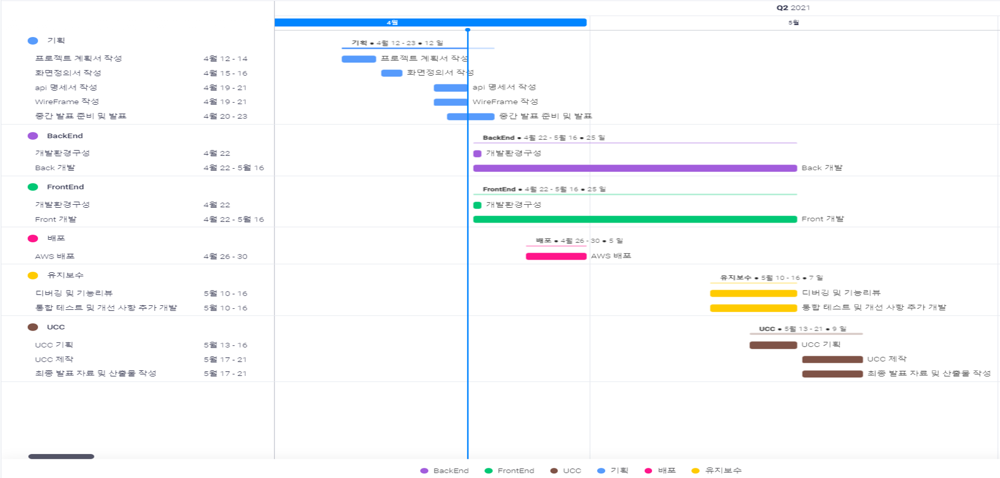


# 기능

#### 냉장고추가 

- 로그인 후 자신의 집과 동일한 냉장고를 등록할 수 있다.
- 하나이상의 냉장고가 등록이 가능하며, 원하는 이름으로 저장한뒤 관리할 수 있다.

#### 재료추가

- 등록한 냉장고에 냉장고에 넣을 재료를 추가할 수 있다.

- 각종 분류를 통해 재료를 선택하고 유통기한을 입력하고 재료들의 관리가 가능하다.

- 재료를 추가한 이후에는 자신의 냉장고에 무슨 재료가 있는 이미지로 한눈에 파악이 가능하다.

  ​                       **냉장고 추가 시연 이미지								 					 재료추가 시연 이미지**

  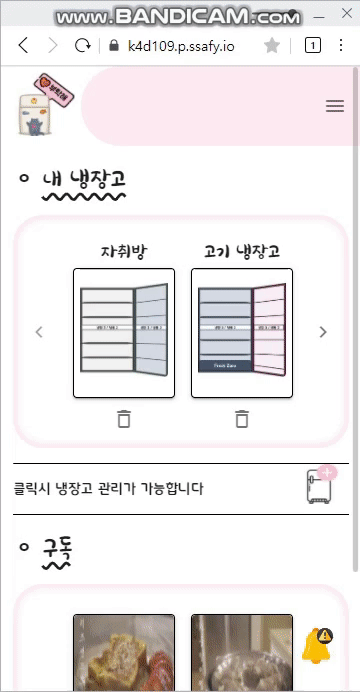	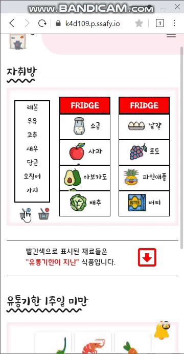


#### 재료빼기

- 자신의 냉장고에 등록한 재료들을 제거할수있다.
- 재료 제거 버튼을 누르면 자신의 냉장고의 재료들의 목록을 확인할 수 있으며, X를 클릭시 냉장고에서 해당재료가 제거된다.

#### 유통기한 임박 재료 

- 유통기한이 1주일 이내인 재료들의 목록을 확인할수있다.

- 1주일 이내의 유통기한을 가지는 재료들은 붉은색으로 표기된다.

   					   ​                         **재료빼기 시연 이미지**                                                 **유통기한 임박 재료 시연 이미지**

  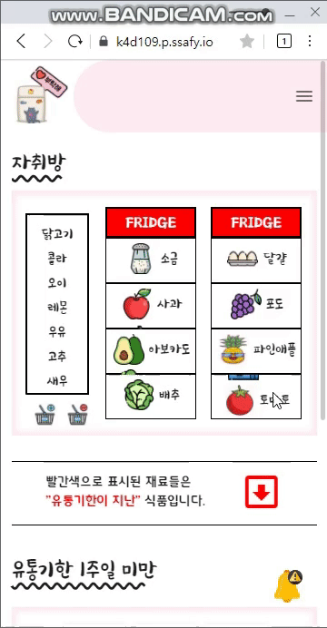	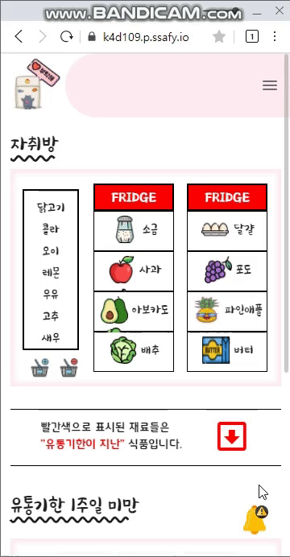


#### 재료 관련레시피 확인

- 원하는 재료를 클릭할시 해당 재료에 맞는 레시피를 출력한다.
- 원하는 레시피를 터치하면 해당 레시피의 내용을 확인할 수 있다.

#### 레시피 내용 확인

- 레시피를 터치하면 레시피 글의 상세 페이지로 이동해 레시피 정보를 제공한다.

- 레시피 상세 내용은 제조 과정 영상을 볼 수 있으며, 영상하단에 필요한 재료와 음식의 정보가 표시된다.

  ​               **재료 관련레시피 확인 시연 이미지**				   				   **레시피 내용 확인 시연 이미지**

  	

#### 포스트 확인

- 다른사람이 올린 게시글의 목록을 확인할수있다.
- 게시글은 작성자가 업로드한 이미지가 섬네일로 표기되며, 게시글 제목과 작성자의 닉네임정보가 표시된다.

#### 포스트 내용 확인

- 게시글을 터치할시 해당 게시글의 상세정보를 확인할수있다.

- 해당 게시글의 작성자가 게시한 레시피를 확인할 수 있으며, 구독하기 버튼을 통해 작성자가 게시한 글의 목록을 확인하거나, 신규 글을 작성할시 알람을 받을 수 있다.

  ​                      **포스트 확인 시연 이미지							  				   포스트 내용 확인 시연 이미지**

  	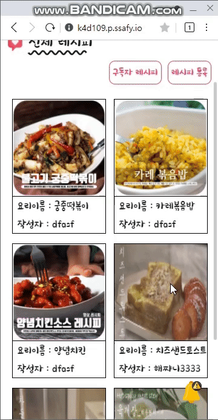

#### 좋아요 기능

- 게시글 상세 확인에서 좋아요와 싫어요를 할수있다.

- 이후 자신이 좋아요를 표시한 글을 모아서 볼 수 있다.

  <center><strong>좋아요 기능 시연 이미지</strong></center>

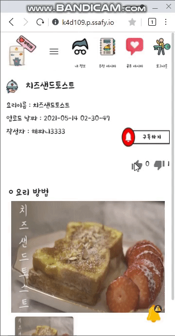

#### 구독 기능 시연 이미지

- 특정한 유저를 구독할수있다.

- 특정한 사용자를 구독하면 구독한 사용자가 글을 작성할때마다 알림을 통해 작성한 게시글을 확인할 수 있다.

  <center><strong>구독 기능 시연 이미지</strong></center>

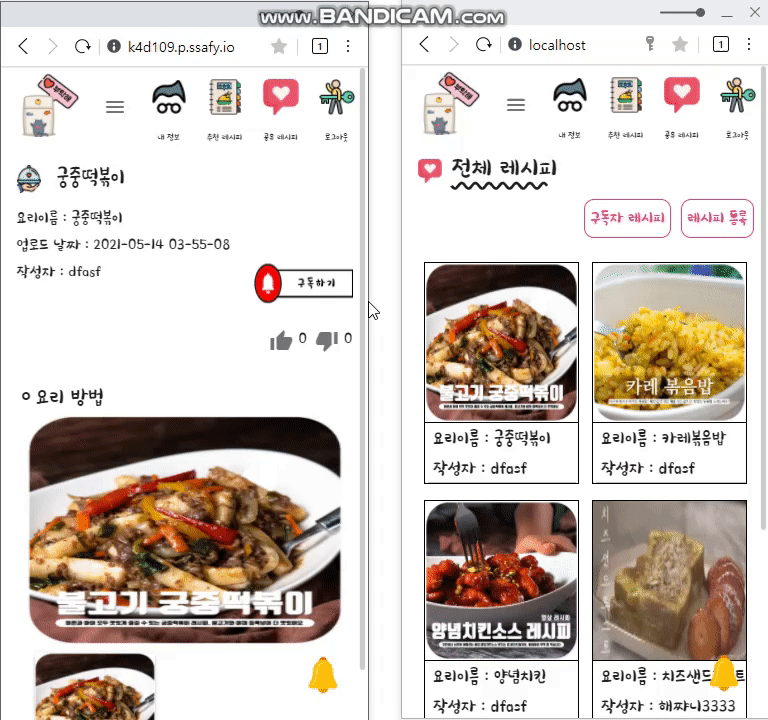

#### 레시피 등록

- 자신이 등록하고 싶은 레시피를 등록할 수 있다.

- 이미지를 이용해 조리과정을 담은 레시피를 등록한다.

  <center><strong>레시피 등록 시연 이미지</strong></center>

  


#### 알림확인

- 자신이 구독한 대상이 게시글을 작성할시 알림이 발생한다.

- 우측 하단의 종모양 이미지를 클릭하면 알림의 목록을 확인할 수 있으며, 해당 알림들을 터치할시 해당글의 상세정보를 확인할수 있다.

  <center><strong>알림확인 시연 이미지</strong></center>

  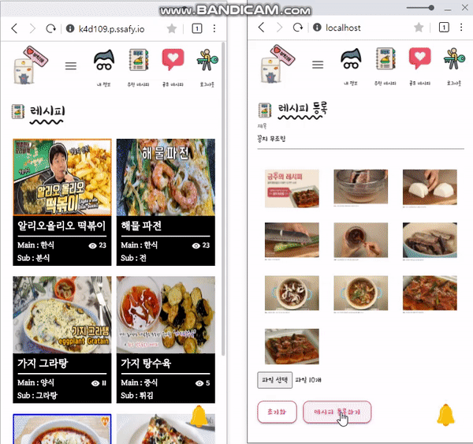

#### 글 확인 기능

- 게시글의 내용을 상세 확인 할 수 있다.

- 하단의 이미지 스크롤을 통해 작성자가 업로드한 레시피 이미지를 확인할수 있다.

  <center><strong>글 확인 기능 시연 이미지</strong></center>

  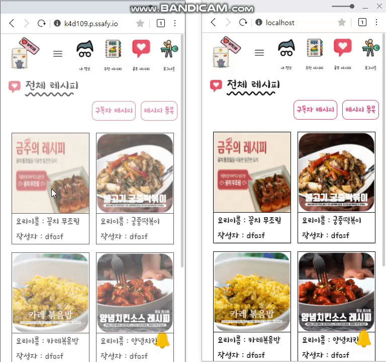

  

# Application Architecture

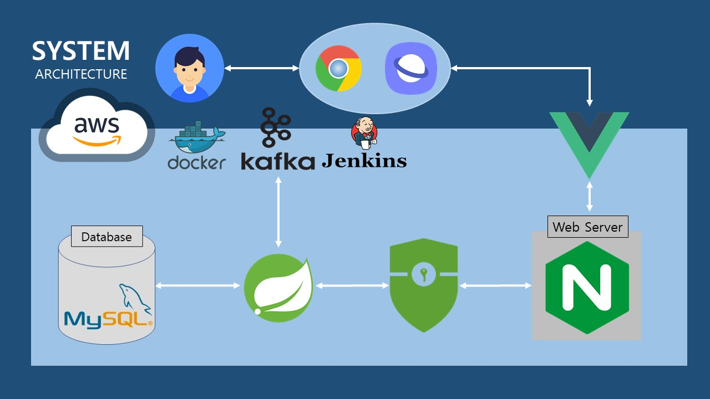


