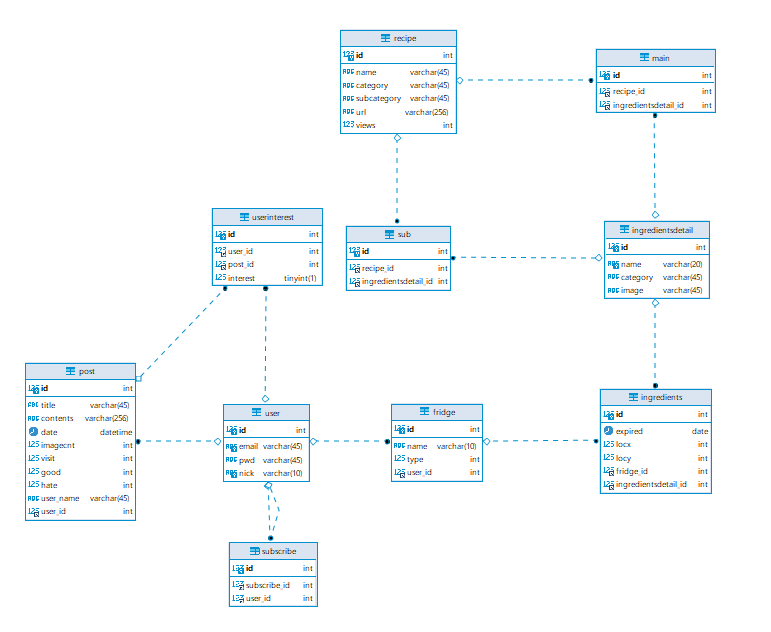

  

# 우냉부?

바쁜 현대 사회인들의 골치거리인 **냉장고 관리**를 도와주는 서비스로

직접적인 재료 및 음식의 **유통기한 관리 및 정리**

간접적으로는 (직접적인 서비스를 위한) **요리 레시피 추천 및 공유의 컨텐츠**를 제공하여,

궁극적으로 **냉장고의 효율적 관리**뿐만아니라 **자연 보호**를 목표로 하는 서비스입니다.


## 프로젝트 기간

**2021.04.12 ~ 2021.05.28**


## 기획 배경

자취생 또는 주부들의 고민인 냉장고 관리를 목적으로 하였습니다.

- 유통기한 관리 : 유통기한을 효율적으로 관리하여 버려지는 음식물 쓰레기를 줄여 환경 파괴를 막고자 기획해보았습니다.

- 냉장고 내부 위치 저장 : 냉장고에 있는 재료들의 위치를 저장하여, 냉장고를 열고 찾는데 소요 되는 시간을 줄여, 에너지 낭비를 막고자 기획해보았습니다.

- 레시피 추천 및 공유 : 단순히 유통기한을 관리 해주는 것만으로는 부족하다고 생각하여, 레시피를 추천하고 사용자들간에 공유할 수 있도록하여 요리 초보들도 냉장고 관리를 잘할 수 있는 컨텐츠를 기획해보았습니다.

  

⇒ 위와 같은 서비스를 통해 효율적 냉장고 관리 및 레시피 추천 및 공유 서비스를 기획했습니다.

------


# Message Broker?

[Kafka (Zookeeper) 아키텍처](https://www.notion.so/Kafka-Zookeeper-746da634cc314fb7a0f4100518454b99)

- 참고자료

[Spring Boot | Kafka를 이용한 채팅 (2) Kafka 연동 설정](https://gaemi606.tistory.com/entry/Spring-Boot-Kafka를-이용한-채팅-2-Kafka-연동-설정?category=745027)

------


# ⚙️Tech Stacks


# DB_ERD




# Installation with Docker

### Kafka와 zookeeper 사용을 위하여 Docker에서 가동하는 방법만 제공

##### windows 10 Docker 설치

https://goddaehee.tistory.com/251

##### Linux(Ubuntu) Docker 및 docker-compose 설치

```shell
# 다음 패키지들을 설치
sudo apt install apt-transport-https ca-certificates
sudo apt install curl gnupg-agent software-properties-common

# Docker의 공식 GPG 키를 추가
curl -fsSL https://download.docker.com/linux/ubuntu/gpg | sudo apt-key add -

# stable respository 를 세팅하기 위한 명령어를 실행
sudo add-apt-repository \
	"deb [arch=amd64] https://download.docker.com/linux/ubuntu bionic stable"

# 가장 최신 버전의 Docker 엔진을 설치한 후, 버전을 확인
sudo apt update
sudo apt install docker-ce docker-ce-cli containerd.io
docker -v # Docker 버전 확인
# docker-compose 설치
sudo curl -L https://github.com/docker/compose/releases/download/1.25.0-rc2/docker-compose-`uname -s`-`uname -m` -o /usr/local/bin/docker-compose
sudo chmod +x /usr/local/bin/docker-compose
```

### Installation

- git clone 및 디렉토리 이동 (windows의 경우 powershell 이용 권장)

  ```shell
  git clone https://lab.ssafy.com/s04-final/s04p31d109.git
  cd s04p31d109
  cd exec
  ```

- 프론트엔드 axios baseURL이 서버(k4d109.p.ssafy.io)로 설정되어 있으므로 localhost로 변경 필요

- exec/frontend/src/api/axios.js 파일 open

- baseURL 주석 변경

  

- docker-compose를 통한 실행

  ```shell
  docker-compose up -d
  ```

---


# EC2 배포

### Nginx & SSL

- HA와 Load Balancing을 위하여 Nginx 적용
- SSL 키를 적용하여 https 준수

### MySQL & Kafka & zookeeper & Jenkins

- docker compose를 통하여 직접 실행하여 jenkins가 자동 실행에도 영향 받지 않도록 실행

- docker 폴더 안에 있는 docker-compose 파일들을 차례로 실행

  ```shell
  docker-compose -f docker-compose-jenkins.yml up -d
  docker-compose -f docker-compose-mysql.yml up -d
  docker-compose -f docker-compose-kafka.yml up -d
  ```

### Docker & Jenkins

- Docker에 Jenkins image를 만들고 Jenkins와 git commit 시 자동으로 업데이트 반영 되도록 배포
- Frontend와 Backend에 각각 Dockerfile을 생성해 배포 설정을 저장

------


# 📚 산출물

[DB Table](https://www.notion.so/DB-Table-d047852191e0455a99c5132aef03e035)

[우냉부 기획 발표자료](https://www.notion.so/00acc056ae1f403a9c366dce9153b22d)

------


# Project Structure

```bash
📦PJT
 ┣ 📂docker				#Docker 설정파일
 ┣ 📂exec
 ┃ ┣ 📂Backend			#Backend
 ┃ 	 ┣ 📂src/main/java	#Backend 코드
 ┃     ┣ 📂com
 ┃       ┣ 📂fridge
 ┃         ┣ 📂common
 ┃           ┣ 📂error
 ┃         ┣ 📂cofig
 ┃           ┣ 📂security
 ┃         ┣ 📂controller
 ┃         ┣ 📂model
 ┃           ┣ 📂dto
 ┃           ┣ 📂repository
 ┃           ┣ 📂service
 ┃ ┣ 📂Frontend			# FrontEnd
 ┃   ┣ 📂vue-front 
 ┃ 	   ┣ 📂src			# Front 코드
 ┃ 	     ┣ 📂api		# 통신관련 Method
 ┃ 	     ┣ 📂assets	
 ┃ 	       ┣ 📂css
 ┃ 	       ┣ 📂images
 ┃ 	     ┣ 📂components
 ┃ 	       ┣ 📂commons
 ┃ 	       ┣ 📂MyPageDialog
 ┃ 	     ┣ 📂plugins
 ┃ 	     ┣ 📂router
 ┃ 	     ┣ 📂store
 ┃ 	     ┣ 📂views
 ┃ 	       ┣ 📂member
 ┃ 	       ┣ 📂Recipe
 ┃ 	       ┣ 📂Refrigerator
 ┃ 	       ┣ 📂Subscribe
 ┣ 📂images				# 프로젝트 스크린샷
 ┃ ┣ 📂wireframe
 ┃ ┣ 📂화면계획
 ┣ 📂outputs			# 산출물
 ┗ 📜README.md			# 프로젝트 README
```

------


# 개발 일정


---


# Application Architecture


---


# TroubleShooting

### CORS

 서버에 배포하였을 때, Swagger 및 frontend에서 API 요청 시 CORS 발생하는 문제가 생겼습니다. Spring Security에서 CORS를 disable 해도 문제가 여전히 해결되지 않았고, corsConfigurationSource Bean을 작성하여도 해결하지 못하였습니다.

 preflight 요청 인증 처리 문제 같아서 CORSUtills::isPreFlightRequest를 requestMatchers에 추가하였지만 해결에 실패하였습니다. 다른 방법을 알아보던 중 WebMvcConfigurer 인터페이스를 implements한 WebConfiguration을 정의를 통하여 웹 페이지에서 보낼 때 발생하는 CORS 문제는 해결하였습니다.

 하지만 여전히 Swagger에서는 CORS가 발생하였고, allowedOrigins에 서버 측 URL을 추가하였지만 실패하습니다. 연구 결과 Swagger에서 테스트 진행 시 http로 서버측에 보내기 때문에 CORS가 발생한다는 것을 파악할 수 있었고, SwaggerConfig 설정에서 @OpenAPIDefinition의 @Server(url) 어노테이션을 이용하여 swagger에서 보내는 요청을 https로 바꿈으로서 해결하였습니다.

### Kafka Consumer

Kafka를 이용한 구독 알람을 제공하는 기능을 구현하기로 하였습니다. 사용자가 게시글을 등록하였을 때, Kafka Topic으로 메시지를 삽입하고 Client가 사이트에 로그인하였을 때, Kafka로 부터 메시지를 요청하여 자신이 구독한 사람이 새 글을 올렸는지 확인할 수 있도록 구현하고자 하였습니다.

AWS에 Docker를 이용하여 Zookeeper와 Kafka를 구동하고 Spring boot를 이용한 producer 모델 구현까지는 무난하게 진행되었습니다. 하지만 Vue단에서 Kafkajs를 이용하여 메시지를 요청하고 가져오는 부분에서 문제가 발생하였습니다.

Kafkajs를 이용하여 배포해둔 Kafka 서버에 연결을 시도하였지만 'Failed to connect: net.connect is not a function'라는 error가 발생하며 Kafka와 연결 자체가 이루어지지 않았습니다. 어떤 문제인지 찾아 보았지만 분명한 원인과 해결방법을 찾지 못하였습니다.

결국 Vue단에서 Kafka에 요청하는 것을 포기하고 Spring에서 Kafka에 연결하여 메시지를 가져오고 Vue단에서 주기적으로 Spring에 요청하는 형식으로 변경하여 구현하기로 하였습니다.

Spring에서 consumer를 구현하는 방법을 찾아보았을 때, Listener 형식을 이용한 consumer 구현 방법이 나왔습니다. 사용자가 요청하였을 때 메시지를 가져오는 방법이 필요하였기에 Listener가 아닌 방법이 필요하였고, 검색한 결과 poll() 메소드를 활용한다면 요청에 의해 메시지를 가져올 수 있을다는 것을 파악하였습니다.

하지만 poll()의 경우 설정한 timeout 시간 안에 들어오는 메시지를 가져오도록 구현되어 있는 메소드였기에 poll 요청을 하기 전에 들어온 메시지의 경우 가져오지 못하는 문제가 있었습니다. poll 요청 시 offset을 지정하는 방법을 찾아 보았고 여러 방법을 시도하던 중, partitionsFor 메소드를 활용하여 topic안에 있는 partition을 추적하고 seek 메소드 이용하여 해당 partition의 offset을 지정하는 방법을 통하여 해결하였습니다.

저희 시스템의 경우 글을 쓴 순서를 보장하기 위하여 partition을 하나만 두었기에 이 방법이 가능하였지만, 만약 partition을 여러개로 분할하여 사용하게 된다면 partition 하나만 추적하게 되기에 poll을 partition 수만큼 요청해야 되는 문제가 생길 것으로 예상 되기에 추후 다른 방법을 찾아보아야 할 것으로 예상됩니다.

### REDOS 위험


소나큐브에서 REDOS위험이 있을 수 있다며, 정규표현식에서 문제가 잡혔습니다. 해결방안으로 Google re2를 사용하라고 적혀 있어, 구글 Re2를 사용하였습니다. 하지만 vue에서 모듈에서 re2를 찾지 못하여 다른 방법을 찾아보았습니다.

먼저, ReDos(정규식 서비스 거부)란 평가하는 데 시간이 오래 걸리는 정규식을 제공하여 서비스 거부를 생성하는 알고리즘 복잡성 공격입니다. 처음엔 정규식이 안전하지 않다고 생각하여, npm에서 `safe-regex`라는 라이브러리를 사용하여 안전한지 먼저 검사하고, 안전하다면 정규식 검사를 하게 작성하였습니다. 그러나 소나큐브에서 여전히 문제가 잡혔습니다.

두 번째 방법으로 아예 안전한 정규식을 사용해보자 하여, [`https://regex101.com/`](https://regex101.com/)에서 제공하는 정규식을 사용하고, 안전한지 검사 후 사용하였습니다. 그러나 이 방법 역시 소나큐브에서 문제가 있다고 잡아냈습니다.

뭐가 문제인지 모르겠어서, 소나큐브에 대해서 검색해보고, 실습코치에게 물어본 결과, 소나큐브에서 `+, *, {` 이 3가지 문자가 2개 이상 사용하게 되면 정규표현식에서 문자열 판단에 시간이 상당히 소요되고 때문에 저런 문자를 2개 이상사용하게 되면 한개 문자열을 판단하는데 더욱 시간이 소요되어 redos 공격에 취약해집니다.

소나큐브에 잡히지 않게 해결하지는 못하였지만, redos에 대해서 알게되었고, safe-regex나 regex101.com처럼 안전한 정규식을 찾는 방법에대해 알게되었습니다.

### ROUTE

 axios를 이용한 통신메소드를 api폴더에 분리하던 중, 화면을 이동하는 route.push도 move.js로 묶어 처리하고 싶었습니다.

 처음에는 vue-router를 임포트하여 vue파일에서 사용하던 것처럼 `this.$route.push()`를사용하였지만, 제대로 되지않았습니다.  그래서 다른 교육생에게 물어보고 같이 고민한 결과, this를 사용하지않고, 임포트 후 바로 ROUTE.push를 하였습니다.

```jsx
import ROUTER from "@/router"

/* 시작 페이지로 이동 */
function moveStart() {
    return ROUTER.push({ name: 'Start' });
}
```

 vue파일에서 사용하던 this.$route.push에서 this는 가장 밖에있는 App.vue와 main.js에서 설정이 되고, main.js에서 router를 등록 했기 때문에 this.$route가 가능합니다

 하지만 아예 다른 폴더로 빼서 move.js를 만들었기 때문에 this.$route가 아닌 ROUTER (지정한 변수)를 사용해야 접근이 가능해 집니다.

### YouTube 가져오기

**기존 url `https://www.youtube.com/watch?v=ilefeIUM68w`**

 iframe태그에서 유튜브 url을 그대로 가져다 쓰면 `Refused to display '<https://www.youtube.com/>' in a frame because it set 'X-Frame-Options' to 'sameorigin'.` 라는 에러가 발생 합니다.

 에러에 대해 찾아보니, 기존 url에서 watch?v= 뒤에 있는 영상ID부분만 추출하여 `https://www.youtube.com/embed/` 수정 해야한다고 합니다. 그래서 **splice() 메소드**를 통해 id부분을 추출 하였습니다.

 그 다음 목록에서 썸네일 부분을 출력하는데, 썸네일 추출방법에 대해 검색 해 보았습니다. 썸네일의 경우도 id를 추출하여 `http://img.youtube.com/vi/영상ID/0.jpg` 형식으로 작성해야한다고 합니다. 하지만 원하는 비율이 되지 않아 좀더 찾아보았고, 그 결과 영상 ID뒤부분에 jpg의 이름에 따라 다른 유형의 썸네일을 얻을수 있었습니다.

- deafult.jpg : 기본 썸네일 이미지
- hqdefault.jpg : 고품질 버전의 미리보기 이미지
- mqdefault.jpg : HQ와 유사한 URL을 사용하는 중간 품질 버전
- sddefault.jpg : 미리보기 이미지의 표준 정의 버전
- maxresdefault.jpg : 축소판의 최대 해상도 버전

### Alarm Dialog(vuex-persistedstate)

 구독 알림 메세지를 받을 때 새 메세지가 오면 알람이미지를 바꾸고, 새 알림을 받는 알람버튼을 만들었습니다. 이 상태를 어떻게 변경시킬까 고민을 헀습니다. 먼저 vuex와 sessionStorage에 dialog를 저장시키는 방식으로 했습니다. 그 결과 페이지 이동시에는 유지가 되지만 새로고침이 되면 상태가 초기화 되어 새 알람이 없지만, 알람이 온 상태의 이미지로 변경되었습니다.

 그 후 고민을 하다가 생각해보니 제가 반대로 생각 하고있었던 점이 있었습니다. 로그인을 했을 때 새 알람이 온 상태이면 안되는데, 계속 새 알람이 온 상태로 두어 flag상태를 true로 두어 동작하니 원하는대로 동작하였습니다. 위 과정을 진행하면서 vuex의 상태가 계속 초기화되는걸 보게 되어서 찾아 봤었고, `vuex-persistedstate`라는 Vue 플러그인 입니다.

 vuex-persistedstate는 새로고침시 vuex의 데이터가 초기화되어 버리는 상황이 발생 하는 불편함을 해소하기위해 localstorage를 이용하여 값들을 다시 살려내주는 기능을 하는 것입니다. 간단하게 원리를 설명하자면, vuex를 사용하는 프로젝트를 프로젝트 전체에서 사용되는 변수를 store의 state에 저장을 하고 사용하게 됩니다. 그러면 vuex-persistedstate는 이 state에 젖아된 변수와 값을 그대로 웹브라우저의 localstorage에 업데이트를 해줍니다. 즉**, state와 localstorage를 지속적으로 동기화를 해주는 역할**을 합니다.

 localstorage는 새로고침을 해도 유지가 되기 때문에 새로 화면이 로딩을 하게 되면 localstorage에 있는 내용을 state에 다시 동기화 시켜줍니다. 이러한 원리로 새로고침에도 state의 값이 변경되지않고 유지됩니다. 

이번 프로젝트에서 제가 잘못생각해서 발생한 문제라 적용하지 않아도 되어 적용하지 않았지만 다음번에 vuex를 통해 값을 초기화시키지 않는 경우가 있으면 적용해 봐야겠다고 생각했습니다.

**[설치방법]**

https://github.com/robinvdvleuten/vuex-persistedstate#readme

```
npm install --save vuex-persistedstate
```

---


# Application Architecture


# 기능

#### 냉장고추가 

- 로그인 후 자신의 집과 동일한 냉장고를 등록할 수 있다.
- 하나이상의 냉장고가 등록이 가능하며, 원하는 이름으로 저장한뒤 관리할 수 있다.

#### 재료추가

- 등록한 냉장고에 냉장고에 넣을 재료를 추가할 수 있다.

- 각종 분류를 통해 재료를 선택하고 유통기한을 입력하고 재료들의 관리가 가능하다.

- 재료를 추가한 이후에는 자신의 냉장고에 무슨 재료가 있는 이미지로 한눈에 파악이 가능하다.

  <p align="center" style="color:black;">
    
      
  </p>

#### 재료 옮기기

- 자신의 냉장고에 등록한 재료들을 GUI 환경에서 옮길수있다.
- 드래그 온 드랍을 이용하여 재료들의 위치를 변경할 수 있다.

#### 재료 빼기

- 자신의 냉장고에 등록한 재료들을 제거할수있다.

- 재료 제거 버튼을 누르면 자신의 냉장고의 재료들의 목록을 확인할 수 있으며, X를 클릭시 냉장고에서 해당재료가 제거된다.

   <p align="center" style="color:black;">
   	 
      
  </p>
  

#### 유통기한 임박 재료 

- 유통기한이 1주일 이내인 재료들의 목록을 확인할수있다.

- 1주일 이내의 유통기한을 가지는 재료들은 붉은색으로 표기된다.

#### 재료 관련레시피 확인

- 원하는 재료를 클릭할시 해당 재료에 맞는 레시피를 출력한다.

- 원하는 레시피를 터치하면 해당 레시피의 내용을 확인할 수 있다.

  <p align="center" style="color:black;">
    
      
  </p>

#### 레시피 내용 확인

- 레시피를 터치하면 레시피 글의 상세 페이지로 이동해 레시피 정보를 제공한다.
- 레시피 상세 내용은 제조 과정 영상을 볼 수 있으며, 영상하단에 필요한 재료와 음식의 정보가 표시된다.

#### 포스트 확인

- 다른사람이 올린 게시글의 목록을 확인할수있다.

- 게시글은 작성자가 업로드한 이미지가 섬네일로 표기되며, 게시글 제목과 작성자의 닉네임정보가 표시된다.

   <p align="center" style="color:black;">
    
      
  </p>

#### 포스트 내용 확인

- 게시글을 터치할시 해당 게시글의 상세정보를 확인할수있다.
- 해당 게시글의 작성자가 게시한 레시피를 확인할 수 있으며, 구독하기 버튼을 통해 작성자가 게시한 글의 목록을 확인하거나, 신규 글을 작성할시 알람을 받을 수 있다.              


#### 좋아요 기능

- 게시글 상세 확인에서 좋아요와 싫어요를 할수있다.

- 이후 자신이 좋아요를 표시한 글을 모아서 볼 수 있다.

  <p align="center" style="color:black;">
    
  	
  </p>

#### 구독 기능

- 특정한 유저를 구독할수있다.

- 특정한 사용자를 구독하면 구독한 사용자가 글을 작성할때마다 알림을 통해 작성한 게시글을 확인할 수 있다.

  <p align="center" style="color:black;">
    
      <br>
  	<p align="center" style="font-weight: bold; color:black;">구독 기능 시연 이미지</p>
  </p>

#### 레시피 등록

- 자신이 등록하고 싶은 레시피를 등록할 수 있다.

- 이미지를 이용해 조리과정을 담은 레시피를 등록한다.

  <p align="center" style="color:black;">
    
      <br>
  	<p align="center" style="font-weight: bold;">레시피 등록 시연 이미지</p>
  </p>

#### 알림 확인

- 자신이 구독한 대상이 게시글을 작성할시 알림이 발생한다.

- 우측 하단의 종모양 이미지를 클릭하면 알림의 목록을 확인할 수 있으며, 해당 알림들을 터치할시 해당글의 상세정보를 확인할수 있다.

  <p align="center" style="color:black;">
    
      <br>
  	<p align="center" style="font-weight: bold;">알림 확인 시연 이미지</p>
  </p>

#### 글 확인 기능

- 게시글의 내용을 상세 확인 할 수 있다.

- 하단의 이미지 스크롤을 통해 작성자가 업로드한 레시피 이미지를 확인할수 있다.

  <p align="center" style="color:black;">
    
      <br>
  	<p align="center" style="font-weight: bold;">글 확인 시연 이미지</p>
  </p>
  

## 팀원 소개

<p align="center" style="color:black;">
  
</p>


