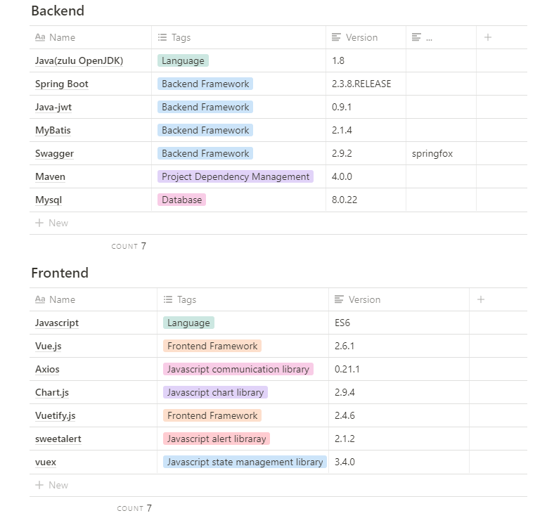

  

# 우냉부?

바쁜 현대 사회인들의 골치거리인 **냉장고 관리**를 도와주는 서비스로

직접적인 재료 및 음식의 **유통기한 관리 및 정리**

간접적으로는 (직접적인 서비스를 위한) **요리 레시피 추천 및 공유의 컨텐츠**를 제공하여,

궁극적으로 **냉장고의 효율적 관리**뿐만아니라 **자연 보호**를 목표로 하는 서비스입니다.

------

## 기획 배경

자취생 또는 주부들의 고민인 냉장고 관리를 목적으로 하였습니다.

- 유통기한 관리 : 유통기한을 효율적으로 관리하여 버려지는 음식물 쓰레기를 줄여 환경 파괴를 막고자 기획해보았습니다.

- 냉장고 내부 위치 저장 : 냉장고에 있는 재료들의 위치를 저장하여, 냉장고를 열고 찾는데 소요 되는 시간을 줄여, 에너지 낭비를 막고자 기획해보았습니다.

- 레시피 추천 및 공유 : 단순히 유통기한을 관리 해주는 것만으로는 부족하다고 생각하여, 레시피를 추천하고 사용자들간에 공유할 수 있도록하여 요리 초보들도 냉장고 관리를 잘할 수 있는 컨텐츠를 기획해보았습니다.

  

⇒ 위와 같은 서비스를 통해 효율적 냉장고 관리 및 레시피 추천 및 공유 서비스를 기획했습니다.

------


# ⚙️Tech Stacks



# DB_ERD


# Installation (예정)

### Frontend

```shell
cd frontend
npm install
npm run serve**
```

- http://localhost:8080/ 에서 확인 가능

### Backend

```shell
cd backend
#window에서 실행 시
.\\mvnw spring-boot:run
```

- http://localhost:8000/swagger-ui.html을 통해 swagger 확인 가능

------


# 배포(예정)

### Docker & Jenkins

- Docker에 Jenkins image를 만들고 Jenkinxs와 git commit 시 자동으로 업데이트 반영 되도록 배포
- Frontend와 Backend에 각각 Dockerfile을 생성해 배포 설저을 저장

### Nginx & SSL

- HA와 Load Balancing을 위하여 Nginx 적용
- SSL 키를 적용하여 https 준수

------


# 파일 구조 (추가 예정)


------


# 개발 일정


# Application Architecture


